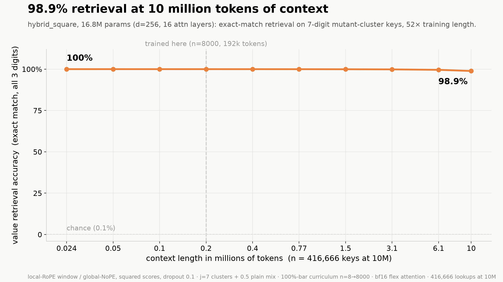
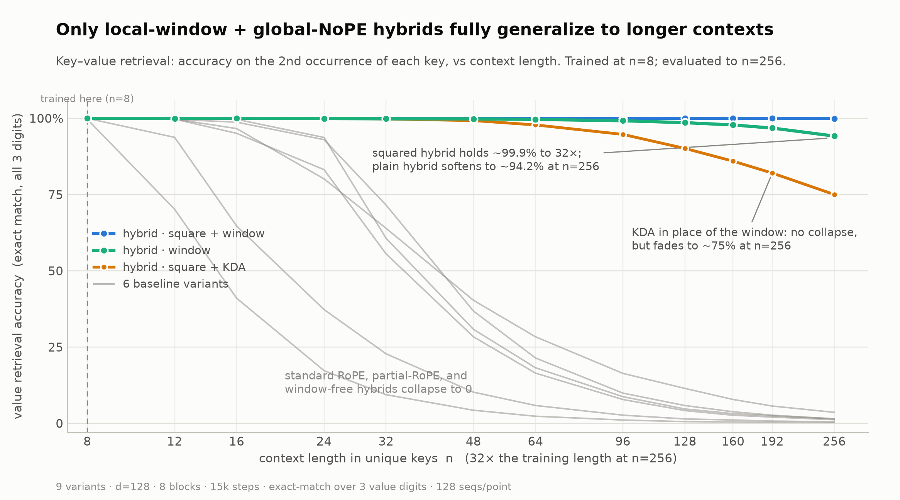
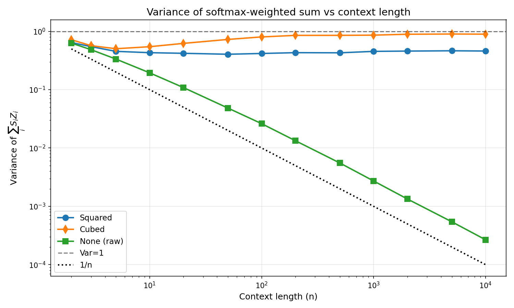
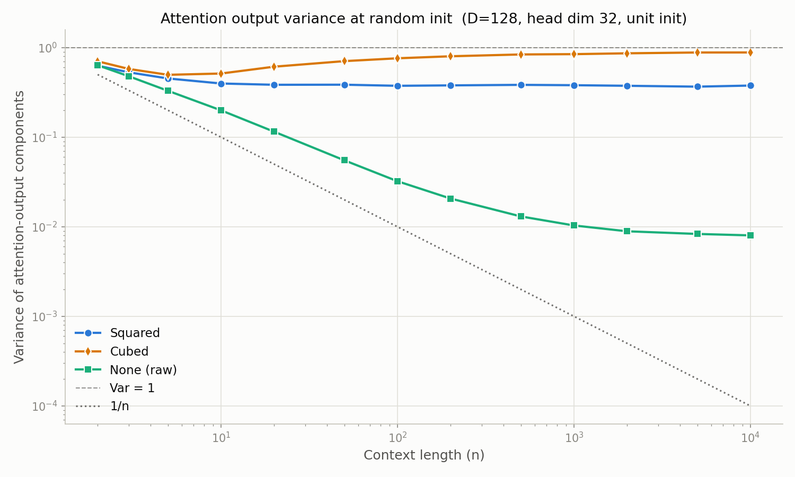

# Key–Value Retrieval: Context-Length Generalization

Which attention design lets a small transformer retrieve a stored value from a
context far longer than it was trained on? This benchmark trains 9 architecture
variants on a synthetic key-value lookup task (needle in a haystack) and measures how retrieval accuracy
holds up as the context grows to 32× the training length.

## The result



Hybrid square, the best variant, achieved 98.9% accuracy on needle in a haystack at a 10 million token context despite only having been trained up to a context of ~200k tokens, a context length extrapolation of ~50x.

Hyperparameters of the long ctx run

| Param | Value |
| :---     | :---:    
| d_model     | 256   
| heads    | 4 x 64
| blocks   | 8 (16 sliding/global attention)
| ffn hidden | 1024
| dropout | 0.1

Training command
```bash
python -m kvbench.train \
    --ultra \
    --steps 100000 \
    --rung-acc 1.0 \
    --rung-cap 0 \
    --dim 256 \
    --heads 4 \
    --blocks 8 \
    --dropout 0.1 \
    --mutant-j 7 \
    --mutant-mix 0.5 \
    --only hybrid_square \
    --runs-dir runs/ultra_dropout_b8
```
early stopped at step 2800

Evaluation sweep out to 10M tokens (writes `runs/ultra_dropout_b8/accuracy_vs_context_ultra.json`)
```bash
python -m kvbench.eval_ultra \
    --runs-dir runs/ultra_dropout_b8 \
    --variants hybrid_square \
    --dim 256 \
    --heads 4 \
    --blocks 8
```



Hybrid square demonstrates strong context length generalization even at very small scales with a 99.9% retrieval accuracy at 4096 token contexts (256 unique keys) while only having been trained at 128 token contexts (8 unique keys), an extrapolation of 32x. Plain hybrid and KDA hybrid square trail at 94.2% and 75% accuracies, respectively, at 256 keys ctx. All other variants collapse by the end.

| variant | n=8 | n=16 | n=32 | n=64 | n=128 | n=256 |
|---|---|---|---|---|---|---|
| `rope` | 99.7 | 41.0 | 9.4 | 2.3 | 0.6 | 0.3 |
| `rope_square` | 100.0 | 96.6 | 63.9 | 28.4 | 11.5 | 3.6 |
| `partial_rope` | 100.0 | 64.7 | 22.8 | 5.9 | 1.4 | 0.5 |
| `partial_rope_square` | 100.0 | 95.1 | 55.6 | 16.5 | 4.2 | 1.2 |
| `hybrid` | 100.0 | 100.0 | 99.8 | 99.6 | 98.6 | 94.2 |
| **`hybrid_square`** | 100.0 | 100.0 | 100.0 | 100.0 | 100.0 | **99.9** |
| `hybrid_nowindow` | 100.0 | 98.7 | 71.6 | 21.4 | 5.8 | 1.5 |
| `hybrid_square_nowindow` | 100.0 | 99.7 | 60.7 | 18.2 | 4.7 | 1.5 |
| `hybrid_square_kda` | 100.0 | 100.0 | 99.8 | 97.8 | 90.1 | 75.0 |

## The task

Each sequence is a list of entries `StartKey <k digits> StartValue <v digits>`.
Every key appears exactly twice with the same value; the entries are shuffled.
The model is trained to predict the value on the second occurrence of a key, a pure in-context lookup. The first occurrence is unpredictable and excluded from
the loss.

- vocabulary: digits `0–9` + `StartKey` + `StartValue` (12 tokens)
- `k = 3` key digits, `v = 3` value digits → 8 tokens per entry
- training: `n = 8` unique keys (16 entries, 128 tokens); evaluation: up to `n = 256`

See `specs/` for the full dataset, training, evaluation, and architecture specs.

## The variants

All share a standard backbone (default init, learnable `LayerNorm` without bias,
plain residuals, SwiGLU FFN, RoPE, GQA/MHA) at `d_model=128`, 8 attention + 8 FFN
layers (~2.1M params). They differ only in the attention layers:

The variants span positional encoding (RoPE/NoPE), sliding window, squared attention scores. One variant replaces sliding window with kimi delta attention layers, making 9 variants total.

| variant | positional encoding | window | squared scores |
|---|---|---|---|
| `rope` / `rope_square` | full RoPE, every layer | none | no / yes |
| `partial_rope` / `partial_rope_square` | RoPE on half of each head's dims | none | no / yes |
| `hybrid` / `hybrid_square` | alternating local-RoPE / global-NoPE | W=10 | no / yes |
| `hybrid_nowindow` / `hybrid_square_nowindow` | alternating local-RoPE / global-NoPE | none | no / yes |
| `hybrid_square_kda` | alternating KDA / global-NoPE | none (KDA is the local memory) | yes (NoPE layers) |

`hybrid_square_kda` is the winning `hybrid_square` layout with the local RoPE
window layers replaced by Kimi Delta Attention as used in Kimi K3
(introduced in [Kimi Linear, arXiv:2510.26692](https://arxiv.org/abs/2510.26692);
K3 tech report §2.1.1, including K3's lower-bounded decay and full-rank output
gate), a gated DeltaNet with per-channel decay, implemented with the
chunkwise-parallel scan. Like a sliding window, KDA is a fading local
memory with no length-dependent state, but learned, content-addressed, and
softmax-free.

## Why squared attention scores

Intuitively, the power of 2 is the critical point for attention scores, where positive powers below 2 lead to dilution and powers above 2 lead to one-hot attention.

$$
E\left[e^{|x|^p}\right]
$$

where $x$ is standard normal distributed is finite for $0 < p < 2$, but becomes infinite at $p = 2$. Despite the expectation of the exponentiated score being infinite, the value component variance for $p = 2$ is stable.
Suppose that the query, key, and value vector components throughout a randomly initialized model are distributed according to the standard normal distribution.
Let $q, k_i, v_i \in \mathbb{R}^d$ and define the scaled dot-product score

$$
s_i = \frac{q \cdot k_i}{\sqrt{d}} \approx \mathcal{N}(0, 1).
$$

The attention weights are the softmax of the scores,

$$
\alpha_i = \frac{e^{s_i}}{\sum_{j=1}^{n} e^{s_j}},
$$

the attention output is

$$
o = \sum_{i=1}^{n} \alpha_i v_i
$$

With the further approximation that the attention scores are independent (approximately true for sufficiently high dimensions) the variance of each output component is the same as

$$
\mathrm{Var}(o_j) = \mathrm{Var}(s \cdot z), \qquad s = \mathrm{softmax}(x), \quad x, z \sim \mathcal{N}(0, I_n)
$$

Graphing that along with variants that use squared and cubed attention scores



This figure is produced by `softmax_weighted_sum_cubed.py` (`python softmax_weighted_sum_cubed.py`).
The raw variant suffers from variance dilution. As context length grows, attention becomes increasingly diffuse and waters down the desired value signal. The cubed variant becomes one-hot like, essentially picking out a single value. The squared score variant is the only one that preserves variance as context scales.
Graphing the variance in a more realistic setting with the independence assumptions relaxed



the overall picture is similar with the cubed going one-hot and the squared scores staying stable, but the raw variant decays to around $1/d$ instead of $1/n$.

This attention correction alone is insufficient for strong context length generalization as other aspects can also bottleneck. Global RoPE layers do not generalize on the needle in a haystack task even with squared score attention. Global KDA layers interleaved with global squared score NoPE layers also suffer decay, though less rapid than most other variants. Context length generalization will be limited by the worst bottleneck.

## Running it

```bash
# train the 9 variants: seed 0 everywhere, except the plain hybrid which
# needs seed 1 (with seed 0 it plateaus on a partial positional shortcut)
python -m kvbench.train --compile --exclude hybrid
python -m kvbench.train --compile --only hybrid --seed 1

# render both figures (recomputes the accuracy-vs-context eval)
python -m kvbench.plots --recompute        # writes figures/*.png
```

Each run writes `runs/<variant>/{metrics.jsonl,eval.json,checkpoints}`.
Requires `torch` and `matplotlib`, a CUDA GPU (set `DEVICE` in `kvbench/config.py`
otherwise). ~7 min per variant (15k steps) on a single consumer GPU.

Training uses a short context-length curriculum (n = 2 → 4 → 6 → 8 keys over the
first 2500 steps) with cosine LR decay. This matters: trained at n = 8 from the
start, every variant whose RoPE layers see full attention gets stuck on a
positional-shortcut local optimum and plateaus at ~37% retrieval *in
distribution*; started at n = 2, where no positional shortcut exists, the
content-match circuit forms first and every variant reaches ≈100% at the
training length. See `specs/training.md`.

## Layout

```
kvbench/
  config.py      all hyperparameters
  data.py        synthetic data, value-position + second-occurrence helpers
  model.py       standard backbone, attention/FFN, the variant grid
  train.py       training loop (second-occurrence-only loss)
  evaluate.py    per-index CE + accuracy-vs-context-length
  plots.py       the two figures
specs/           dataset / training / evaluation / architecture specs
figures/         final figures
```
