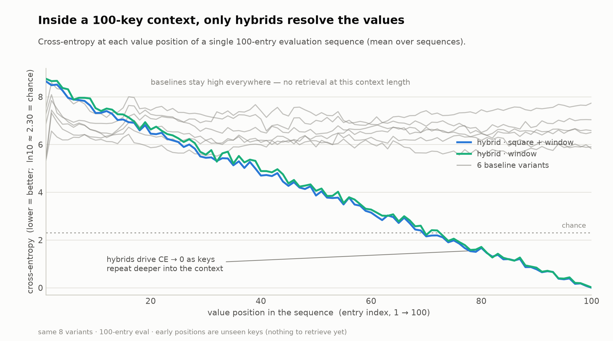

# Key–Value Retrieval: Context-Length Generalization

Which attention design lets a small transformer **retrieve a stored value from a
context far longer than it was trained on?** This benchmark trains 8 architecture
variants on a synthetic key-value lookup task and measures how retrieval accuracy
holds up as the context grows to 32× the training length.

## The task

Each sequence is a list of entries `StartKey <k digits> StartValue <v digits>`.
Every key appears **exactly twice with the same value**; the entries are shuffled.
The model is trained to predict the value on the **second** occurrence of a key —
a pure in-context lookup. The first occurrence is unpredictable and excluded from
the loss.

- vocabulary: digits `0–9` + `StartKey` + `StartValue` (12 tokens)
- `k = 3` key digits, `v = 3` value digits → 8 tokens per entry
- training: `n = 8` unique keys (16 entries, 128 tokens); evaluation: up to `n = 256`

See `specs/` for the full dataset, training, evaluation, and architecture specs.

## The variants

All share a standard backbone (default init, learnable `LayerNorm` without bias,
plain residuals, SwiGLU FFN, RoPE, GQA/MHA) at `d_model=128`, 8 attention + 8 FFN
layers (~2.1M params). They differ only in the attention layers:

| variant | positional encoding | window | squared scores |
|---|---|---|---|
| `rope` / `rope_square` | full RoPE, every layer | — | no / yes |
| `partial_rope` / `partial_rope_square` | RoPE on half of each head's dims | — | no / yes |
| `hybrid` / `hybrid_square` | alternating local-RoPE / global-NoPE | W=10 | no / yes |
| `hybrid_nowindow` / `hybrid_square_nowindow` | alternating local-RoPE / global-NoPE | none | no / yes |

## Why squared attention scores

Standard attention does not scale. As context length grows, attention becomes
increasingly diffuse and waters down the desired value signal. The solution is to
square the attention scores before softmax. The power of 2 of attention scores is
the critical point of stability. Less than 2, and attention grows diffuse. Greater
than 2, and attention spikes as context grows.

This can be seen by analyzing the value variance as the context length grows.
Assume the keys, queries, and values are distributed according to the standard
normal distribution. The resulting attention scores are then standard normally
distributed because of the scale factor used in attention. The following graph
shows how the value variance changes as the context length grows depending on the
operation applied to the attention scores. The value variance of None decays
rapidly (diffuse), Cubed approaches 1 (spikes), but Squared remains stable between
0 and 1.


This figure is produced by `softmax_weighted_sum_cubed.py` (`python
softmax_weighted_sum_cubed.py`).

I cannot claim complete credit for quadratic attention as I encountered it in an
article linked in an X post. However, this attention correction on its own is only
part of the solution to context length generalization. Without correctly handling
the position embeddings, models still will not generalize to context lengths longer
than what is encountered during training.

## The result

**Only the hybrid variants with a sliding window generalize.** The best,
`hybrid_square`, holds ~99% exact-match retrieval all the way out to n=256 (32× the
training length); the plain `hybrid` decays slowly, from ~100% to ~93% over the same
range. Every other variant — plain RoPE, partial RoPE, and the window-free hybrids —
collapses to ~0 as the context grows. The sliding window is essential:
`hybrid_nowindow` is no better than plain RoPE. The mechanism is what you'd expect:
confining RoPE to short local
windows and letting position-free (NoPE) layers do the long-range content lookup
makes retrieval length-agnostic, whereas RoPE alone cannot extrapolate to unseen
positions.




## Running it

```bash
# train all 8 variants and render both figures
python -m kvbench --compile

# or step by step
python -m kvbench.train --compile          # writes runs/<variant>/{metrics.jsonl,eval.json,checkpoints}
python -m kvbench.plots                     # writes figures/*.png
```

Requires `torch` and `matplotlib`, a CUDA GPU (set `DEVICE` in `kvbench/config.py`
otherwise). All 8 variants take ~1 hour on a single consumer GPU.

## Layout

```
kvbench/
  config.py      all hyperparameters
  data.py        synthetic data, value-position + second-occurrence helpers
  model.py       standard backbone, attention/FFN, the variant grid
  train.py       training loop (second-occurrence-only loss)
  evaluate.py    per-index CE + accuracy-vs-context-length
  plots.py       the two figures
specs/           dataset / training / evaluation / architecture specs
figures/         final figures
```
